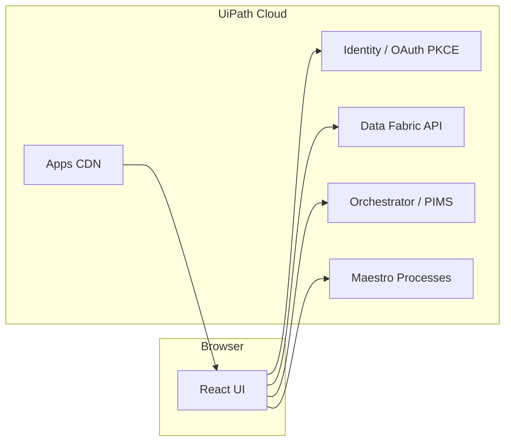

# Architektura

## Przegląd

**DPD Fleet Manager** to aplikacja React (Vite) wdrożona jako **UiPath Coded Web App**. Działa w przeglądarce pod adresem hostowanym przez Automation Cloud (`*.staging.uipath.host` lub `*.uipath.host`).



## Warstwy aplikacji

| Warstwa | Pliki | Odpowiedzialność |
|---------|-------|------------------|
| UI | `src/App.tsx`, `src/components/*` | Tabela rekordów, faktura, analiza, historia pojazdu |
| Auth | `src/hooks/useAuth.tsx`, `src/utils/oauthRedirect.ts` | OAuth PKCE, meta tagi z hosta |
| Data Fabric | `src/services/dataFabric.ts` | Encje `DPD_POC`, `DPD_VehicleFlags`, pliki faktur |
| Maestro | `src/services/maestro.ts` | Start/poll procesu `DPDDataInvestigator` |
| Konfiguracja | `src/config.ts` | ID encji, nazwy procesów, kolumny tabeli |

## Integracje

### Data Fabric

- **DPD_POC** (`4e2e38d9-bf4a-f111-8ef3-000d3a261acd`) — główna tabela kosztów / faktur.
- **DPD_VehicleFlags** (`8d83c3fe-c34a-f111-8ef3-000d3a261acd`) — historia flag dla pojazdu (join po **Vehicle ID** = numer rejestracyjny).

Pola faktury (PDF/obraz) są wykrywane dynamicznie — kandydaci w `INVOICE_FILE_FIELD_CANDIDATES` (`src/config.ts`).

### Maestro / Orchestrator

- Release: `DPDDataInvestigator.agentic.Agentic.Process`
- Folder: `Shared/DPDDataInvestigator`
- Wejście BPMN: `InRecord_Id` = Id rekordu z Data Fabric

### Hosting

Orchestrator wstrzykuje do `index.html` meta tagi (`uipath:client-id`, `uipath:cdn-base`, `uipath:folder-key`). Aplikacja **nie** polega wyłącznie na `VITE_*` na hoście — zmienne build-time uzupełniają konfigurację w Studio / dev.

## Pakiet NuGet

| Element | Wartość |
|---------|---------|
| Package ID | `DPDCarInvestigator.AppV2.DPDAppMonitor` |
| Routing (URL) | `/dpdmonitoring/` |
| Studio project | `28ac09c2-3a5c-4ba8-a78c-80883f38e6b5` |
| Folder Orchestrator | `Shared/DPDCarInvestigator` |

Build produkuje `dist/` → `scripts/repack-nupkg.mjs` pakuje `.nupkg` → skrypt deploy uploaduje i publikuje.

## Debug w przeglądarce

Po wyborze rekordu w konsoli dostępny jest podgląd surowych pól:

```javascript
window.__lastRecord
```

Użyj tego przy dopasowywaniu nazw pól faktury z Data Fabric.
