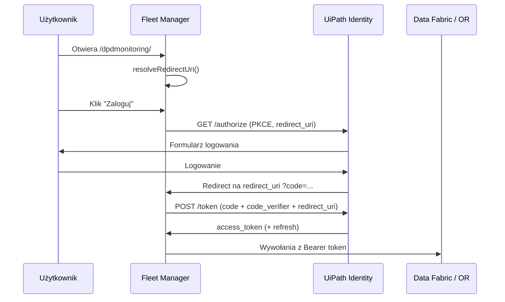

# OAuth 2.0 i Redirect URI

Pełny przewodnik po uwierzytelnianiu **DPD Fleet Manager** w UiPath Automation Cloud: External Application, PKCE, `redirect_uri` i typowe błędy.

Powiązane: [DEVELOPMENT.md](DEVELOPMENT.md) · [MIGRATION-STAGING-TO-PRODUCTION.md](MIGRATION-STAGING-TO-PRODUCTION.md) · [TROUBLESHOOTING.md](TROUBLESHOOTING.md)

---

## 1. Model uwierzytelniania

| Element | Wartość w projekcie |
|---------|---------------------|
| Typ aplikacji | **Non-Confidential** (publiczna, bez client secret) |
| Flow | **Authorization Code + PKCE** (S256) |
| Kto loguje się | Użytkownik końcowy (user scopes) |
| SDK | `@uipath/uipath-typescript` (`UiPath` + `setMultiLogin()`) |

Aplikacja **nie** używa client credentials do logowania użytkownika w przeglądarce — token użytkownika jest wymagany do Data Fabric i Orchestrator.

### Endpointy Identity

Dla staging (`VITE_UIPATH_BASE_URL=https://staging.api.uipath.com`, org `mzpocevylrxu`):

| Krok | URL |
|------|-----|
| Authorize | `https://staging.api.uipath.com/mzpocevylrxu/identity_/connect/authorize` |
| Token | `https://staging.api.uipath.com/mzpocevylrxu/identity_/connect/token` |

Dla production zamień host na `https://cloud.uipath.com` i nazwę organizacji production.

### Parametry authorize (logicznie)

SDK wysyła m.in.:

- `client_id` — Application ID z External Application
- `redirect_uri` — **musi być identyczny** z zarejestrowanym URL (patrz sekcja 3)
- `response_type=code`
- `scope` — lista z `VITE_UIPATH_SCOPE` / meta `uipath:scope`
- `code_challenge` / `code_challenge_method=S256` (PKCE)

W żądaniu **token** ten sam `redirect_uri` musi się powtórzyć.

---

## 2. Konfiguracja External Application

### Portal (staging)

https://staging.uipath.com/mzpocevylrxu/portal_/admin/external-apps/oauth

### Portal (production)

`https://cloud.uipath.com/<org-name>/portal_/admin/external-apps/oauth`

### Kroki utworzenia / edycji

1. **Add Application** → typ **Non-Confidential**
2. Włącz **Authorization Code** + **PKCE** (bez client secret)
3. **Application ID** = `VITE_UIPATH_CLIENT_ID` w `.env` (staging: `98aa3ef7-06e0-431b-9997-1963d708bd45`)
4. **User scopes** (minimum dla Fleet Manager):

| Obszar | Scope |
|--------|--------|
| Data Fabric | `DataFabric.Schema.Read`, `DataFabric.Data.Read` |
| Procesy / foldery | `PIMS`, `OR.Execution`, `OR.Jobs`, `OR.Folders.Read` |

5. **Redirect URL** — lista dokładnych adresów (sekcja 4)

6. Użytkownik testowy musi należeć do organizacji i tenanta (`DefaultTenant` na staging)

### `setMultiLogin()` — dlaczego

Kod wywołuje `sdk.setMultiLogin()` (`src/utils/uipathOAuth.ts`), żeby **nie wysyłać** `acr_values` przypiętego do jednej organizacji. Bez tego Identity czasem zwraca **401 Invalid or missing account**, gdy użytkownik jest zalogowany na inne konto Microsoft/Google niż członkostwo w org staging.

---

## 3. Czym jest `redirect_uri`

`redirect_uri` to adres, na który UiPath **przekierowuje przeglądarkę** po zalogowaniu (z parametrem `code` lub `error`).

UiPath wymaga **dokładnego dopasowania** (case, host, path, obecność lub brak `/` na końcu).

### Czego NIE wlicza się do `redirect_uri`

| Element | Przykład | Uwzględniane? |
|---------|----------|----------------|
| Query string | `?origin=orchestratorFolder&...` | **Nie** |
| Hash | `#section` | **Nie** |
| `index.html` na końcu path | `.../dpdmonitoring/index.html` | **Normalizowane** do `.../dpdmonitoring` |

### Jak aplikacja liczy `redirect_uri`

Implementacja: `src/utils/oauthRedirect.ts` → `resolveRedirectUri()`.

**Kolejność priorytetów:**

```
1. Meta tag <meta name="uipath:redirect-uri" content="...">  (wstrzykiwane przy deploy hosted)
2. VITE_UIPATH_REDIRECT_URI z builda (.env)
3. window.location.origin + znormalizowany pathname
```

Normalizacja pathname (`normalizeRedirectPathname`):

- usuwa `/index.html` z końca ścieżki
- usuwa końcowy `/` (oprócz samego `/`)

**Przykład hosted staging:**

```
URL w pasku:  https://mzpocevylrxu.staging.uipath.host/dpdmonitoring/?origin=...
redirect_uri: https://mzpocevylrxu.staging.uipath.host/dpdmonitoring
```

### Skąd biorą się meta tagi na hosted

Po deploy Orchestrator wstrzykuje do `index.html` m.in.:

```html
<meta name="uipath:client-id" content="...">
<meta name="uipath:redirect-uri" content="https://mzpocevylrxu.staging.uipath.host/dpdmonitoring">
<meta name="uipath:scope" content="...">
<meta name="uipath:org-name" content="...">
<meta name="uipath:tenant-name" content="...">
<meta name="uipath:base-url" content="https://staging.api.uipath.com">
```

Na hoście **priorytet ma** `uipath:redirect-uri` z meta (zarejestrowany URI deployu), nie pełny URL z query.

### Build-time vs runtime

| Źródło | Kiedy używane |
|--------|----------------|
| `VITE_UIPATH_*` w `.env` | Wbudowane przy `npm run build`; fallback gdy brak meta |
| Meta `uipath:*` | Hosted app po deploy |
| `window.location` | Dev (`npm run dev`), gdy brak meta i pusty `VITE_UIPATH_REDIRECT_URI` |

**Zasada:** po zmianie `VITE_UIPATH_CLIENT_ID` lub scope — **zbuduj ponownie** i wdróż pakiet.

---

## 4. Lista Redirect URI do rejestracji

### Hosted — staging (obowiązkowe)

Zarejestruj **oba hosty** (nazwa org i GUID org) oraz **wariant ze slashem i bez**:

```
https://mzpocevylrxu.staging.uipath.host/dpdmonitoring
https://mzpocevylrxu.staging.uipath.host/dpdmonitoring/
https://c9ffe0f3-25c8-4539-a40f-1cb8e9248fd2.staging.uipath.host/dpdmonitoring
https://c9ffe0f3-25c8-4539-a40f-1cb8e9248fd2.staging.uipath.host/dpdmonitoring/
```

Opcjonalnie (gdy platforma serwuje `index.html` w path):

```
https://mzpocevylrxu.staging.uipath.host/dpdmonitoring/index.html
https://c9ffe0f3-25c8-4539-a40f-1cb8e9248fd2.staging.uipath.host/dpdmonitoring/index.html
```

Funkcja `getHostedRedirectUriCandidates()` w kodzie generuje tę listę — ekran błędu logowania też ją wyświetla.

### Lokalny development (Vite)

```
http://localhost:5173
http://localhost:5173/
```

Ustaw w `.env` tylko jeśli chcesz wymusić stały redirect (inaczej SDK weźmie URL z przeglądarki):

```env
VITE_UIPATH_REDIRECT_URI=http://localhost:5173
```

### Studio Web — podgląd w designerze

URL z paska w Studio **różni się** od hosted Orchestrator. Skopiuj **origin + pathname** (bez query), np.:

```
https://staging.uipath.com/mzpocevylrxu/studio_/designer/28ac09c2-3a5c-4ba8-a78c-80883f38e6b5
https://staging.uipath.com/mzpocevylrxu/studio_/designer/28ac09c2-3a5c-4ba8-a78c-80883f38e6b5/
```

Jeśli testujesz tylko w designerze — dodaj te URI do External Application.  
Do testów produkcyjnych UX **otwieraj hosted URL**, nie podgląd Studio.

### Hosted — production (po migracji)

Zamień host i org:

```
https://<production-org-name>.uipath.host/dpdmonitoring
https://<production-org-name>.uipath.host/dpdmonitoring/
https://<production-org-guid>.uipath.host/dpdmonitoring
https://<production-org-guid>.uipath.host/dpdmonitoring/
```

**Osobna** External Application na production — **nie** używaj staging Client ID.

---

## 5. Zmienne środowiskowe OAuth

| Zmienna | Opis |
|---------|------|
| `VITE_UIPATH_CLIENT_ID` | Application ID (External Application) |
| `VITE_UIPATH_SCOPE` | Scopes oddzielone spacją |
| `VITE_UIPATH_ORG_NAME` | Nazwa organizacji (`mzpocevylrxu`) |
| `VITE_UIPATH_TENANT_NAME` | Tenant (`DefaultTenant`) |
| `VITE_UIPATH_BASE_URL` | `https://staging.api.uipath.com` lub `https://cloud.uipath.com` |
| `VITE_UIPATH_REDIRECT_URI` | Opcjonalny sztywny redirect (zwykle **puste** na hosted) |
| `VITE_BYPASS_AUTH` | `true` = mock bez OAuth (tylko dev) |

Przykład `.env` staging: [.env.example](../.env.example)  
Przykład production: [.env.production.example](../.env.production.example)

---

## 6. Przepływ logowania (krok po kroku)



1. Użytkownik otwiera aplikację pod **docelowym** hosted URL (nie stary bookmark z `?errorCode=`).
2. SDK buduje URL authorize z `redirect_uri` z sekcji 3.
3. Po sukcesie Identity przekierowuje na zarejestrowany URI z `?code=...`.
4. Aplikacja wymienia kod na token — **ten sam** `redirect_uri` w POST `/token`.
5. Token jest używany do Data Fabric i Maestro.

---

## 7. UI pomocy w aplikacji

Przy błędzie OAuth ekran logowania pokazuje:

- **redirect_uri przekazywany do SDK** — dokładny string do skopiowania do External Application
- **Listę wszystkich zalecanych URI** (`getHostedRedirectUriCandidates()`)
- Link do portalu External Applications

W trybie dev (`npm run dev`) w konsoli:

```
[OAuth] SDK redirect_uri: ...
[OAuth] SDK config { baseUrl, orgName, redirectUri, scope, ... }
```

---

## 8. Typowe błędy

### `invalid_redirect_uri`

| Przyczyna | Rozwiązanie |
|----------|-------------|
| URI nie dodany w External Application | Dodaj dokładny URI z ekranu błędu aplikacji |
| Różny slash na końcu | Zarejestruj **oba**: z `/` i bez `/` |
| Zły host (org name vs org GUID) | Zarejestruj oba hosty `*.staging.uipath.host` |
| Test w Studio designer bez osobnego URI | Dodaj URI designera lub testuj na hosted |
| `VITE_UIPATH_REDIRECT_URI` ≠ URL w przeglądarce | Usuń override lub zsynchronizuj oba |

### `Invalid or missing account` (401)

| Przyczyna | Rozwiązanie |
|----------|-------------|
| Konto nie jest w org staging | Zaloguj się w https://staging.uipath.com/mzpocevylrxu |
| Zły tenant | Użyj członkostwa w `DefaultTenant` |
| Stare `acr_values` | W projekcie jest `setMultiLogin()` — upewnij się, że wdrożona jest aktualna wersja |

### `invalid_client`

Niepoprawny `VITE_UIPATH_CLIENT_ID` lub nieaktywna External Application.

### `access_denied`

Użytkownik anulował logowanie lub brak scope — sprawdź User scopes w portalu.

### `invalid_grant`

Wygasły kod autoryzacji — zamknij kartę, usuń query `?errorCode=` z URL, zaloguj ponownie.

### Błąd w URL aplikacji (`?errorCode=...`)

Po błędzie OAuth adres może zawierać parametry query. Aplikacja czyści je (`clearOAuthQueryFromUrl`), ale **nie zmienia** `redirect_uri`. Otwórz czysty URL:

```
https://mzpocevylrxu.staging.uipath.host/dpdmonitoring/
```

---

## 9. Checklist przed pierwszym logowaniem

- [ ] External Application: Non-Confidential + PKCE
- [ ] Client ID = `VITE_UIPATH_CLIENT_ID` w `.env` i w portalu
- [ ] User scopes: Data Fabric + PIMS + OR.*
- [ ] Wszystkie Redirect URI z sekcji 4 (staging lub production)
- [ ] `npm run build` z aktualnym `.env`
- [ ] Deploy hosted — meta `uipath:redirect-uri` w View Source
- [ ] Użytkownik jest członkiem org i tenanta
- [ ] Test w incognito na hosted URL (bez starych parametrów query)

---

## 10. Migracja OAuth staging → production

| Element | Staging | Production |
|---------|---------|------------|
| Portal External Apps | `staging.uipath.com/...` | `cloud.uipath.com/...` |
| `VITE_UIPATH_BASE_URL` | `https://staging.api.uipath.com` | `https://cloud.uipath.com` |
| Hosted host | `*.staging.uipath.host` | `*.uipath.host` |
| Client ID | Osobny GUID | **Nowy** GUID |
| Redirect URI | `...staging.uipath.host/dpdmonitoring` | `...uipath.host/dpdmonitoring` |

Szczegóły: [MIGRATION-STAGING-TO-PRODUCTION.md](MIGRATION-STAGING-TO-PRODUCTION.md)

---

## 11. Odniesienia w kodzie

| Plik | Odpowiedzialność |
|------|------------------|
| `src/utils/oauthRedirect.ts` | `resolveRedirectUri`, normalizacja, lista URI, błędy URL |
| `src/utils/uipathOAuth.ts` | Tworzenie SDK, `setMultiLogin`, logi dev |
| `src/hooks/useAuth.tsx` | Kontekst auth, ekran logowania, konfiguracja |
| `uipath.json` | `clientId`, `redirectUri` w pakiecie NuGet |
| `.env.example` | Szablon zmiennych staging |
